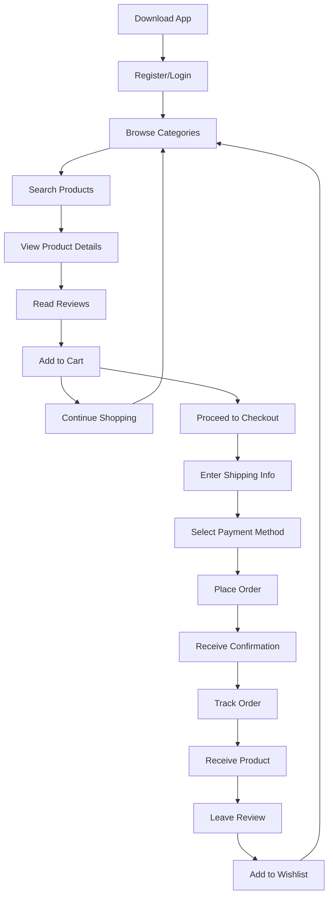
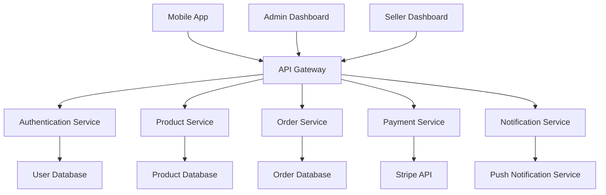
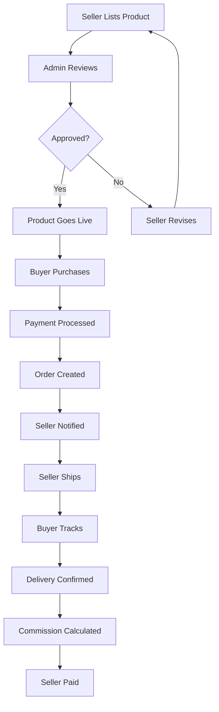
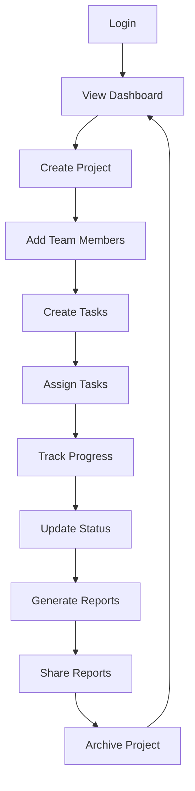
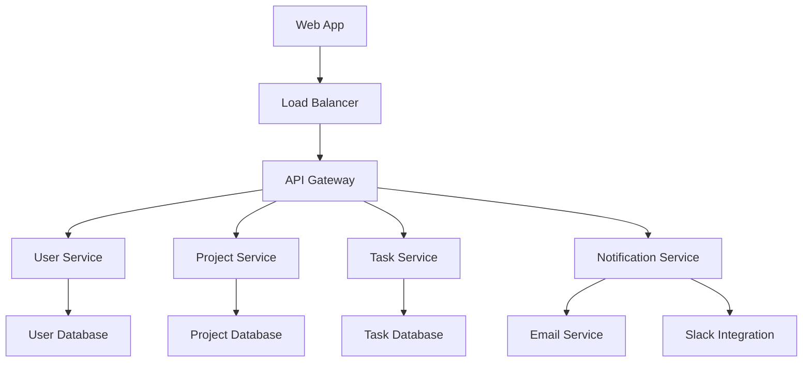
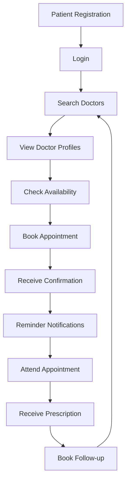
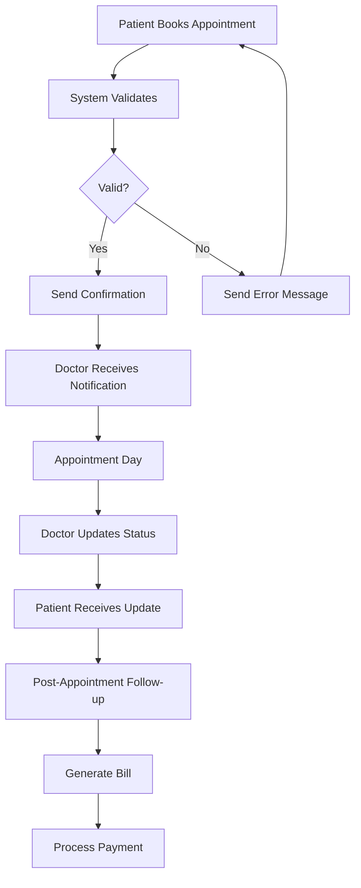
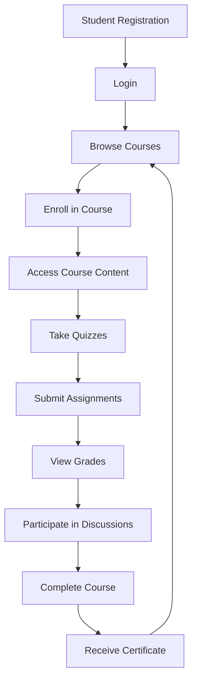
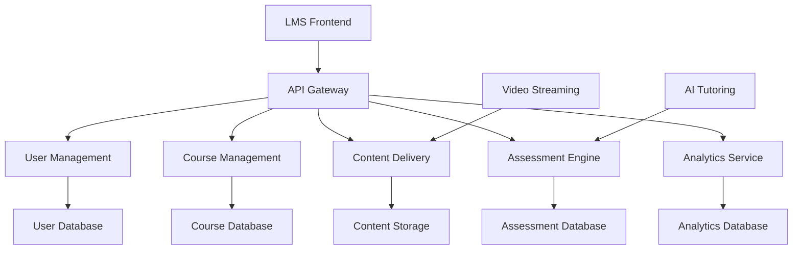

# 🎯 STAGE 1: EXAMPLE OUTPUTS

## **EXAMPLE 1: E-COMMERCE MOBILE APP**

### **User Journey Flow**

### **System Architecture Flow**

### **Business Process Flow**

## **EXAMPLE 2: PROJECT MANAGEMENT TOOL**

### **User Journey Flow**

### **System Architecture Flow**

## **EXAMPLE 3: HEALTHCARE APPOINTMENT SYSTEM**

### **User Journey Flow**

### **Business Process Flow**

## **EXAMPLE 4: LEARNING MANAGEMENT SYSTEM**

### **User Journey Flow**

### **System Architecture Flow**

## **USAGE NOTES**

### **How to Use These Examples:**
1. **Study the patterns** in each example
2. **Adapt the flows** to your specific requirements
3. **Modify the components** based on your technology stack
4. **Add or remove steps** as needed for your use case

### **Customization Tips:**
1. **Replace generic terms** with your specific terminology
2. **Add error handling** paths where needed
3. **Include security checkpoints** for sensitive applications
4. **Add integration points** for external systems
5. **Consider mobile vs web** differences in user flows
