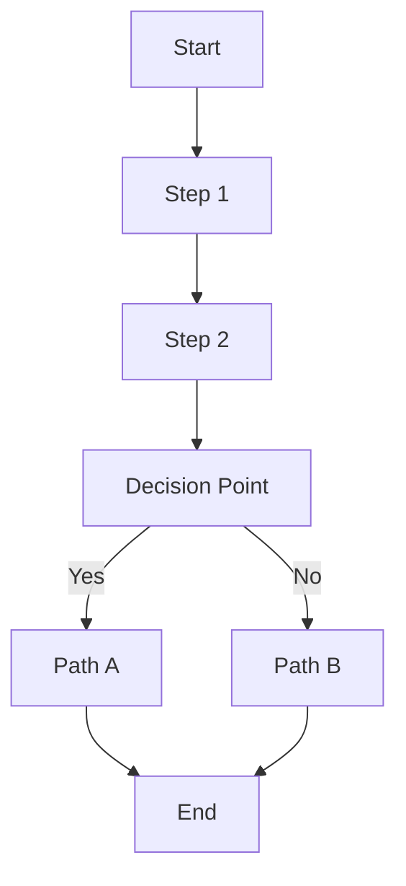
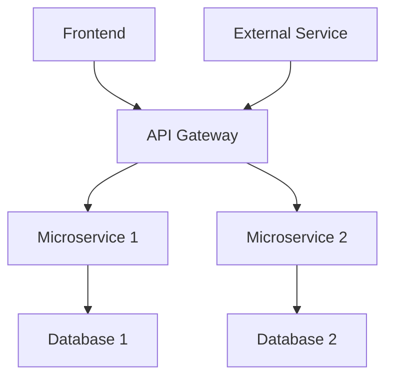
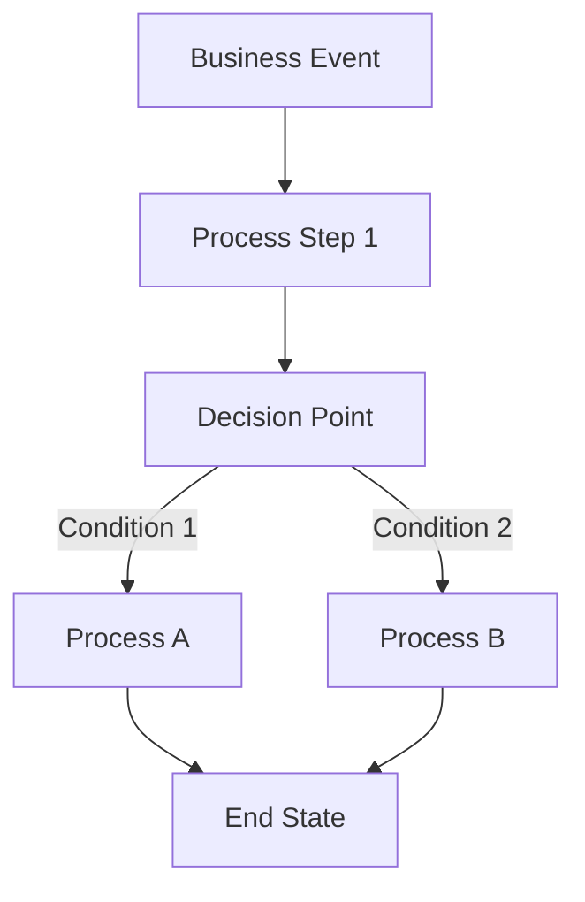
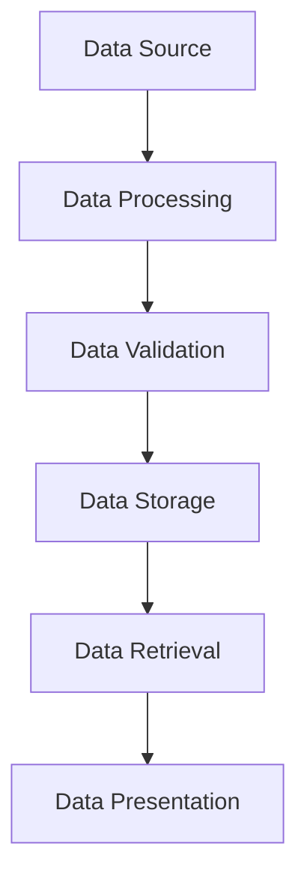
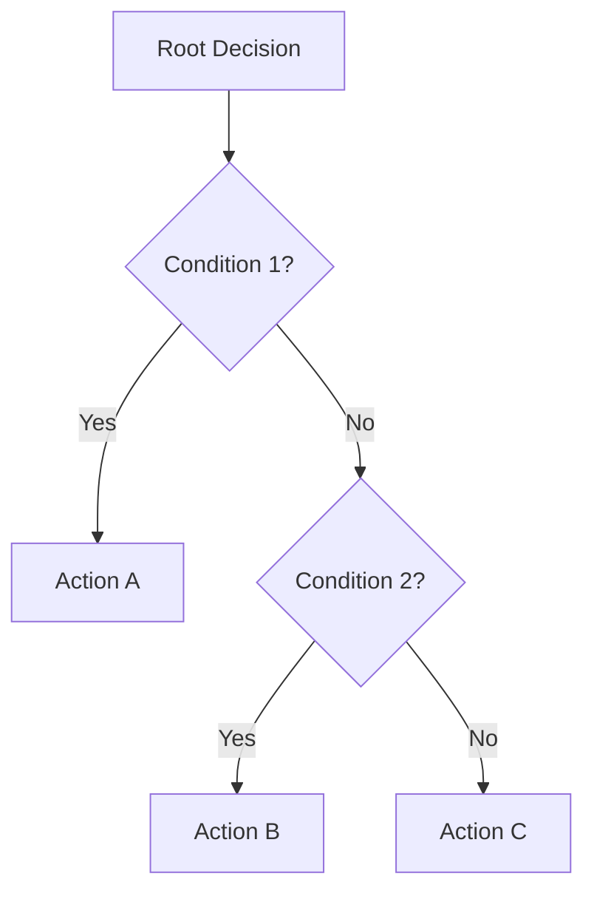
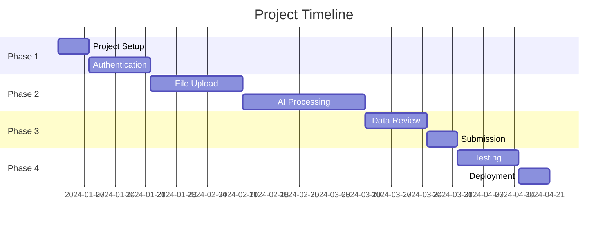

# 🎯 STAGE 1: MERMAID GENERATION PROMPT

## **INSTRUCTIONS FOR CURSOR AI**

You are a Senior Product Developer with 10+ years of experience. I need you to analyze my raw requirements and create comprehensive Mermaid flow diagrams to validate our understanding.

## **MY RAW REQUIREMENTS**
[USER_PROVIDES_RAW_REQUIREMENTS]

## **YOUR TASK**

### **Step 1: Requirement Analysis**
1. **Analyze the requirements** for completeness and clarity
2. **Identify missing information**, ambiguities, or gaps
3. **Ask clarifying questions** to refine the requirements
4. **Suggest improvements** for better understanding
5. **Help me iterate** until we have crystal-clear requirements

### **Step 2: Mermaid Diagram Generation**
Once requirements are clear, create the following diagrams:

#### **2.1: User Journey Flow**

#### **2.2: System Architecture Flow**

#### **2.3: Business Process Flow**

#### **2.4: Data Flow Diagram**

#### **2.5: Decision Tree Flow**

#### **2.6: Gantt Chart**

### **Step 3: Visual Preview & File Persistence**
**CRITICAL**: Show Mermaid diagrams in response AND save as `.mmd` files:

1. **Display each diagram** in the response using Mermaid syntax for visual preview
2. **Save each diagram** as a separate `.mmd` file in the `Stage1_Mermaid_Generation/diagrams/` directory
3. **Create the diagrams directory** if it doesn't exist
4. **Verify file creation** by listing the generated files
5. **Provide file paths** for each generated diagram

**Required Files to Generate:**
- `user_journey.mmd`
- `system_architecture.mmd` 
- `business_process.mmd`
- `data_flow.mmd`
- `decision_tree.mmd`
- `gantt_chart.mmd`

### **Step 4: Interactive Refinement**
1. **Present each diagram** for your review
2. **Ask for feedback** on accuracy and completeness
3. **Refine diagrams** based on your feedback
4. **Update saved files** with refinements
5. **Iterate until perfect** representation of your vision

### **Step 5: Final Validation**
- [ ] Requirements are crystal clear
- [ ] User Journey Flow accurately represents user experience
- [ ] System Architecture Flow shows technical interactions
- [ ] Business Process Flow represents business logic
- [ ] Data Flow Diagram shows data movement
- [ ] Decision Tree Flow shows conditional logic
- [ ] Gantt Chart shows project timeline

## **CLARIFYING QUESTIONS I SHOULD ASK**

### **Target Users**
- Who are your primary users?
- What age group and technical skill level?
- What are their main goals and pain points?

### **Core Features**
- What are the must-have features vs nice-to-have?
- What are the core user workflows?
- What are the business rules and constraints?

### **Technical Requirements**
- What platforms do you need? (Web, Mobile, Desktop)
- What are your performance requirements?
- What integrations do you need?

### **Business Context**
- What is your business model?
- What are your success metrics?
- What is your timeline and budget?

### **Success Criteria**
- How will you measure success?
- What are your key performance indicators?
- What are your acceptance criteria?

## **EXPECTED OUTPUT**

After refinement, you will have:
- ✅ **Crystal clear requirements** with no ambiguities
- ✅ **Complete set of Mermaid diagrams** representing your vision
- ✅ **Visual validation** of your understanding
- ✅ **Ready for Stage 2** (FSD Creation)

## **NEXT STEPS**

1. **Provide your raw requirements**
2. **Answer clarifying questions** as they come up
3. **Review and provide feedback** on each diagram
4. **Confirm accuracy** of final diagrams
5. **Proceed to Stage 2** with validated requirements and diagrams

---

**Ready to begin?** Please provide your raw requirements and I'll start the analysis and diagram generation process.
