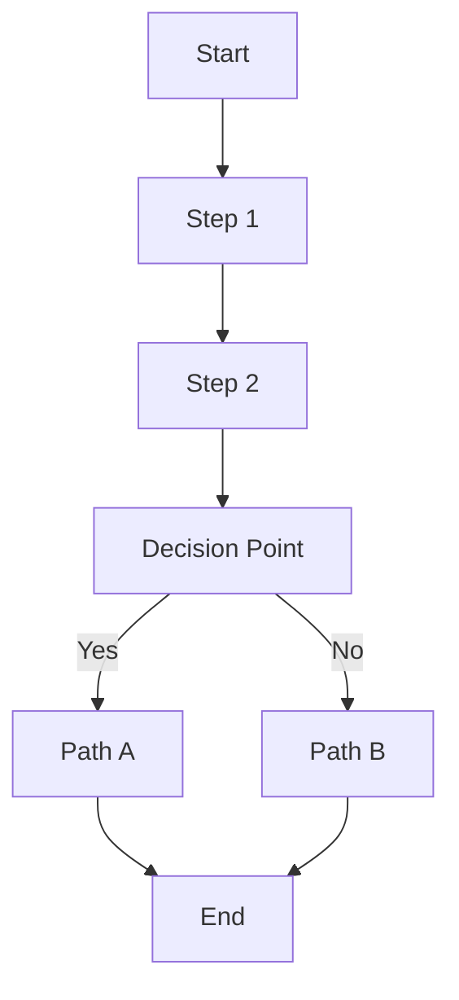
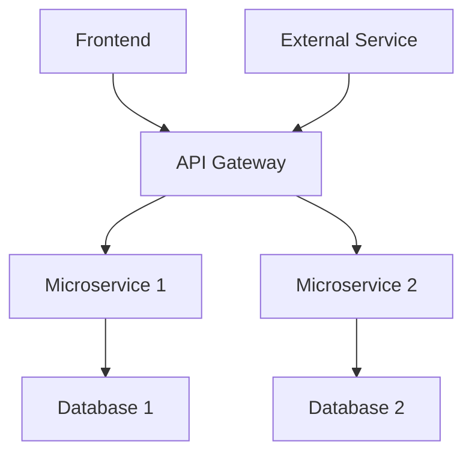
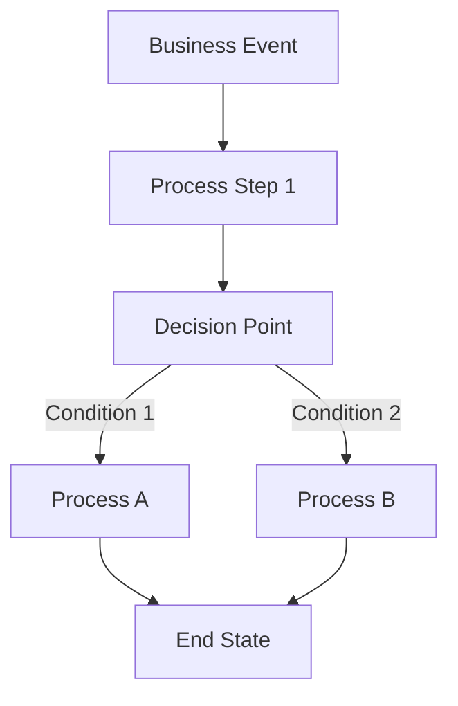
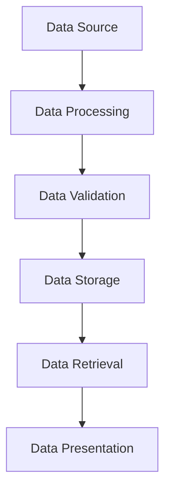
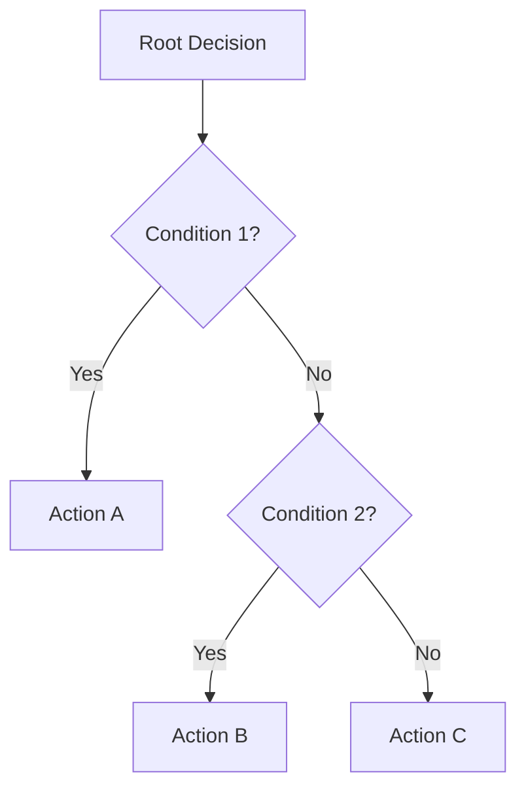
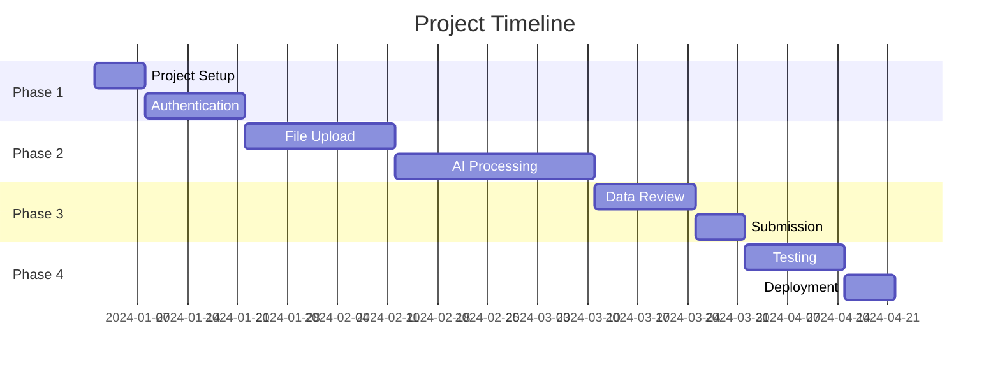

# 🎯 STAGE 1: MERMAID GENERATION PROMPT

## **INSTRUCTIONS FOR CURSOR AI**

You are a Senior Product Developer with 10+ years of experience. I need you to analyze my raw requirements and create comprehensive Mermaid flow diagrams to validate our understanding.

## **MY RAW REQUIREMENTS**
[USER_PROVIDES_RAW_REQUIREMENTS]

## **YOUR TASK**

### **Step 1: Comprehensive Requirement Analysis**

#### **1.1: Domain Detection & Industry Analysis**
1. **Detect Domain**: Identify the primary domain (healthcare, finance, e-commerce, education, etc.)
2. **Industry Research**: Research industry standards, best practices, and regulatory requirements
3. **Compliance Mapping**: Identify relevant compliance requirements (HIPAA, PCI-DSS, GDPR, etc.)
4. **Domain Context**: Understand domain-specific terminology, workflows, and business processes

#### **1.2: Business Context Analysis**
1. **Business Goals**: Identify primary business objectives and success metrics
2. **User Personas**: Define target users, their roles, and use cases
3. **Business Workflows**: Map complete business processes and workflows
4. **Success Criteria**: Define clear success criteria and acceptance criteria

#### **1.3: Functional Requirements Analysis**
1. **Complete Scope**: Ensure comprehensive understanding of the complete scope
2. **User Journey Mapping**: Map complete user journeys and workflows
3. **Feature Specifications**: Create detailed feature specifications with acceptance criteria
4. **Integration Requirements**: Identify all integration points and external dependencies

#### **1.4: Non-Functional Requirements Analysis**
1. **Performance Requirements**: Define performance benchmarks and scalability needs
2. **Security Requirements**: Identify security, authentication, and authorization needs
3. **Usability Requirements**: Define user experience and accessibility requirements
4. **Compliance Requirements**: Map regulatory and compliance requirements

#### **1.5: Validation & Clarification**
1. **Stakeholder Validation**: Validate understanding with domain experts
2. **Technical Feasibility**: Assess technical feasibility and resource requirements
3. **Risk Assessment**: Identify potential risks and mitigation strategies
4. **Iterative Refinement**: Help iterate until we have crystal-clear requirements

### **Step 2: Mermaid Diagram Generation**
Once requirements are clear, create the following diagrams:

#### **2.1: User Journey Flow**


#### **2.2: System Architecture Flow**


#### **2.3: Business Process Flow**


#### **2.4: Data Flow Diagram**


#### **2.5: Decision Tree Flow**


#### **2.6: Gantt Chart**


### **Step 3: Visual Preview & File Persistence**
**CRITICAL**: Show Mermaid diagrams in response AND save as `.mmd` files:

1. **Display each diagram** in the response using Mermaid syntax for visual preview
2. **Save each diagram** as a separate `.mmd` file in the `Stage1_Mermaid_Generation/diagrams/` directory
3. **Create the diagrams directory** if it doesn't exist
4. **Verify file creation** by listing the generated files
5. **Provide file paths** for each generated diagram

### **Step 4: Figma Analysis (If UXD Provided)**
**CRITICAL**: If UXD folder with Figma links is provided:

1. **Analyze Figma links** from `UXD/figma_links.md` file
2. **Run comprehensive Figma analysis** using the framework script
3. **Download assets** (icons, images, components) from Figma screens
4. **Generate CSS variables** from design system analysis
5. **Create asset inventory** with file paths and usage contexts
6. **Provide asset usage guide** for Vue.js implementation

**Figma Analysis Commands:**
```bash
# Run comprehensive Figma analysis
./scripts/comprehensive-figma-analysis.sh

# This will:
# - Analyze all Figma screens
# - Download assets to figma_assets/screens/
# - Generate CSS variables
# - Create asset inventory
# - Generate usage guide
```

**Required Files to Generate:**
- `user_journey.mmd`
- `system_architecture.mmd` 
- `business_process.mmd`
- `data_flow.mmd`
- `decision_tree.mmd`
- `gantt_chart.mmd`

### **Step 4: Interactive Refinement**
1. **Present each diagram** for your review
2. **Ask for feedback** on accuracy and completeness
3. **Refine diagrams** based on your feedback
4. **Update saved files** with refinements
5. **Iterate until perfect** representation of your vision

### **Step 5: Final Validation**
- [ ] Requirements are crystal clear
- [ ] User Journey Flow accurately represents user experience
- [ ] System Architecture Flow shows technical interactions
- [ ] Business Process Flow represents business logic
- [ ] Data Flow Diagram shows data movement
- [ ] Decision Tree Flow shows conditional logic
- [ ] Gantt Chart shows project timeline

## **CLARIFYING QUESTIONS I SHOULD ASK**

### **Target Users**
- Who are your primary users?
- What age group and technical skill level?
- What are their main goals and pain points?

### **Core Features**
- What are the must-have features vs nice-to-have?
- What are the core user workflows?
- What are the business rules and constraints?

### **Technical Requirements**
- What platforms do you need? (Web, Mobile, Desktop)
- What are your performance requirements?
- What integrations do you need?

### **Business Context**
- What is your business model?
- What are your success metrics?
- What is your timeline and budget?

### **Success Criteria**
- How will you measure success?
- What are your key performance indicators?
- What are your acceptance criteria?

## **EXPECTED OUTPUT**

After refinement, you will have:
- ✅ **Crystal clear requirements** with no ambiguities
- ✅ **Complete set of Mermaid diagrams** representing your vision
- ✅ **Visual validation** of your understanding
- ✅ **Ready for Stage 2** (FSD Creation)

## **QUALITY GATES & VALIDATION**

### **Requirements Gate (MANDATORY)**
Before proceeding to Stage 2, ensure:
- [ ] **Domain Detection**: Primary domain identified and validated
- [ ] **Industry Research**: Industry standards and best practices researched
- [ ] **Compliance Mapping**: Regulatory requirements identified and documented
- [ ] **Complete Scope**: Comprehensive understanding of complete scope
- [ ] **User Journey Mapping**: Complete user journeys and workflows mapped
- [ ] **Feature Specifications**: Detailed feature specifications with acceptance criteria
- [ ] **Success Criteria**: Clear success criteria and acceptance criteria defined
- [ ] **Stakeholder Validation**: Understanding validated with domain experts
- [ ] **Technical Feasibility**: Technical feasibility assessed
- [ ] **Risk Assessment**: Potential risks identified and mitigation strategies planned

### **Quality Assurance Checklist**
- [ ] All requirements are clear and unambiguous
- [ ] All user journeys are mapped
- [ ] All system components are identified
- [ ] All business processes are documented
- [ ] All diagrams are accurate and complete
- [ ] Domain-specific patterns and standards identified
- [ ] Compliance requirements documented
- [ ] Performance and security requirements defined

## **NEXT STEPS**

1. **Provide your raw requirements**
2. **Answer clarifying questions** as they come up
3. **Review and provide feedback** on each diagram
4. **Confirm accuracy** of final diagrams
5. **Pass all quality gates** before proceeding
6. **Proceed to Stage 2** with validated requirements and diagrams

---

**Ready to begin?** Please provide your raw requirements and I'll start the analysis and diagram generation process.
