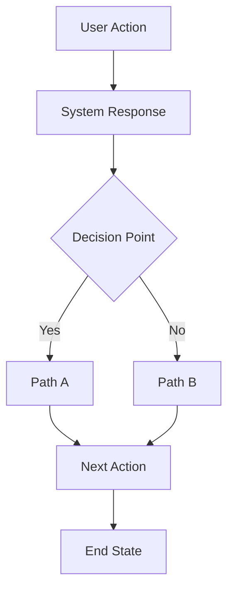
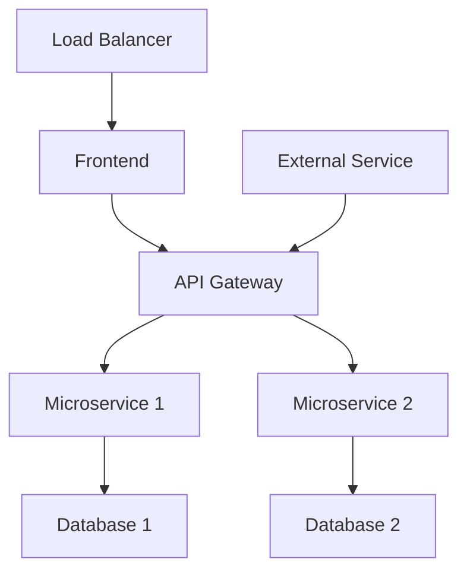
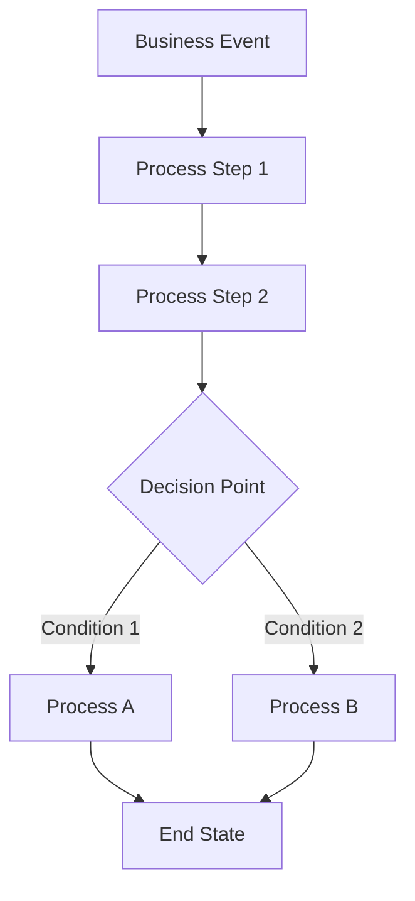
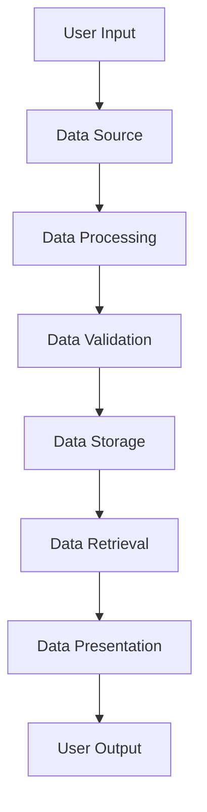
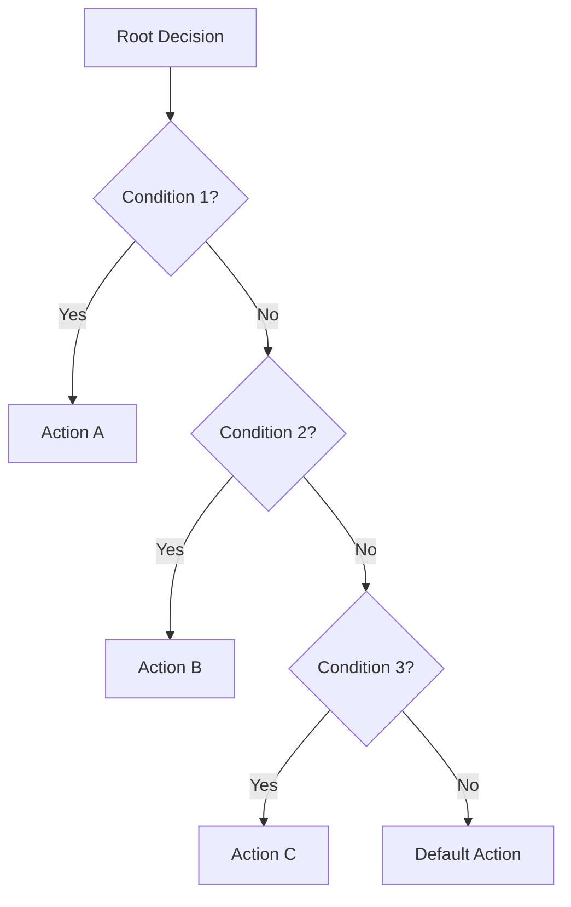
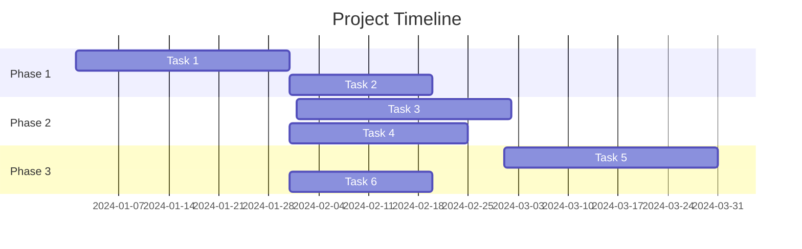

# 🎯 STAGE 1: MERMAID TEMPLATES

## **USER JOURNEY FLOW TEMPLATE**

## **SYSTEM ARCHITECTURE FLOW TEMPLATE**

## **BUSINESS PROCESS FLOW TEMPLATE**

## **DATA FLOW DIAGRAM TEMPLATE**

## **DECISION TREE FLOW TEMPLATE**

## **GANTT CHART TEMPLATE**

## **CUSTOMIZATION GUIDE**

### **For User Journey Flow:**
- Replace `User Action` with specific user actions
- Replace `System Response` with actual system responses
- Add more decision points as needed
- Include error handling paths

### **For System Architecture Flow:**
- Replace `Frontend` with your frontend technology
- Replace `Microservice` with your actual services
- Add load balancers, CDNs, etc.
- Include external integrations

### **For Business Process Flow:**
- Replace `Business Event` with actual business events
- Replace `Process Step` with actual process steps
- Add business rules and constraints
- Include approval workflows

### **For Data Flow Diagram:**
- Replace `Data Source` with actual data sources
- Replace `Data Processing` with actual processing steps
- Add data transformation steps
- Include data security measures

### **For Decision Tree Flow:**
- Replace `Root Decision` with actual decision points
- Replace `Condition` with actual business conditions
- Add more decision levels as needed
- Include exception handling

### **For Gantt Chart:**
- Replace `Task` with actual project tasks
- Adjust dates based on your timeline
- Add dependencies between tasks
- Include milestones and deliverables
