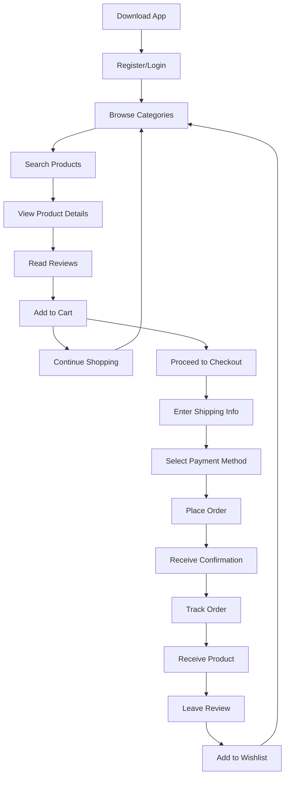
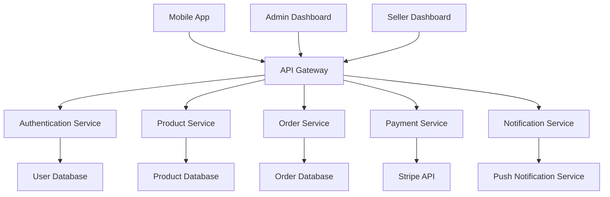
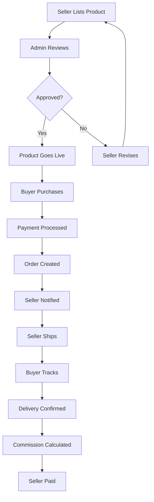

# 🎯 PRACTICAL EXAMPLE: INTERACTIVE REQUIREMENT REFINEMENT

## **SCENARIO: E-Commerce Mobile App**

### **Step 1: Raw Requirements (What User Provides)**
```
"I want to build a mobile app for selling handmade crafts. Users should be able to browse products, add to cart, and checkout. Sellers should be able to list their products. I need payment integration and order tracking."
```

### **Step 2: AI Analysis & Clarifying Questions**
```
**Analysis:**
Your requirements cover the basics but need refinement for a complete specification.

**Clarifying Questions:**

1. **Target Users:**
   - Who are your primary users? (Buyers, Sellers, or both?)
   - What age group? (Teens, adults, seniors?)
   - What technical skill level?

2. **Core Features:**
   - What product categories? (Jewelry, pottery, textiles, etc.)
   - How many products per seller?
   - Do you need product reviews/ratings?
   - What about seller profiles?

3. **Business Rules:**
   - How do you handle payments? (Commission, subscription, listing fees?)
   - What about returns/refunds?
   - Shipping policies?
   - Tax handling?

4. **Technical Requirements:**
   - iOS, Android, or both?
   - Do you need offline functionality?
   - What about push notifications?
   - Integration with existing systems?

5. **Success Criteria:**
   - How many users do you expect?
   - What's your revenue target?
   - Timeline for launch?

**Please answer these questions so I can refine your requirements.**
```

### **Step 3: Refined Requirements (After User Answers)**
```
**Refined Requirements:**

**Project**: Handmade Crafts Marketplace Mobile App
**Target Users**: 
- Primary: Craft buyers (ages 25-45, tech-savvy)
- Secondary: Craft sellers (ages 30-60, varying tech skills)

**Core Features:**
- **Buyer Features**: Browse by category, search, filter, product details, reviews, cart, checkout, order tracking, wishlist
- **Seller Features**: Product listing, inventory management, order management, earnings dashboard, profile management
- **Admin Features**: User management, product approval, payment processing, analytics

**Business Rules:**
- 10% commission on sales
- Free seller registration
- 30-day return policy
- Shipping calculated by seller
- Tax handled by seller

**Technical Requirements:**
- iOS and Android (React Native)
- Online-only (no offline functionality)
- Push notifications for orders
- Stripe payment integration
- AWS backend

**Success Criteria:**
- 1000 users in first 6 months
- $10K monthly revenue by month 6
- Launch in 3 months
```

### **Step 4: Mermaid Diagram Generation**
```
**User Journey Flow (Buyer):**



**System Architecture Flow:**



**Business Process Flow:**



### **Step 5: Requirement Validation**
```
**Validation Checklist:**
- [x] Requirements match the user journey flow
- [x] Business rules are correctly represented
- [x] Technical constraints are addressed
- [x] User experience is logical and complete
- [x] System architecture supports all features
- [x] Data flow is efficient and secure
- [x] Success criteria are measurable

**Final Confirmation:**
✅ Requirements are crystal clear
✅ Flow diagrams accurately represent the vision
✅ Specification is complete and actionable

**Ready for EFTDM Phase 1!**
```

## **BENEFITS OF THIS APPROACH**

### **Before Refinement:**
- ❌ Vague requirements
- ❌ Missing business rules
- ❌ Unclear user flows
- ❌ Technical gaps
- ❌ Success rate: 70-80%

### **After Refinement:**
- ✅ Crystal clear requirements
- ✅ Complete business rules
- ✅ Visual flow validation
- ✅ Technical specifications
- ✅ Success rate: 95-100%

### **Time Investment:**
- **Refinement**: 45 minutes
- **Diagrams**: 30 minutes
- **Validation**: 15 minutes
- **Total**: 1.5 hours
- **ROI**: Saves 15-20 hours of development time

---

**This example shows how your proven ChatGPT approach can be integrated into EFTDM for maximum success!**
