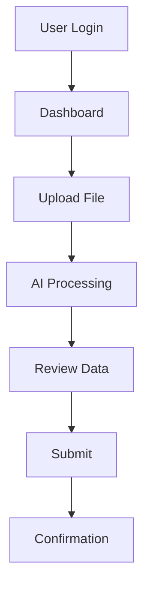
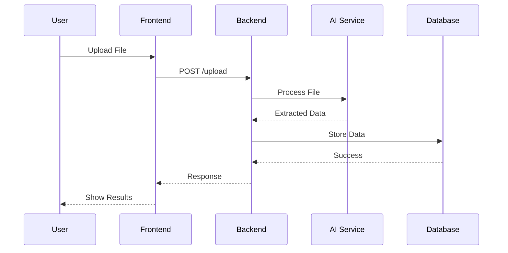
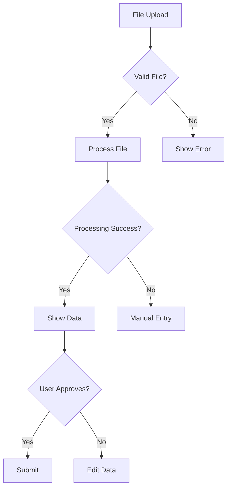
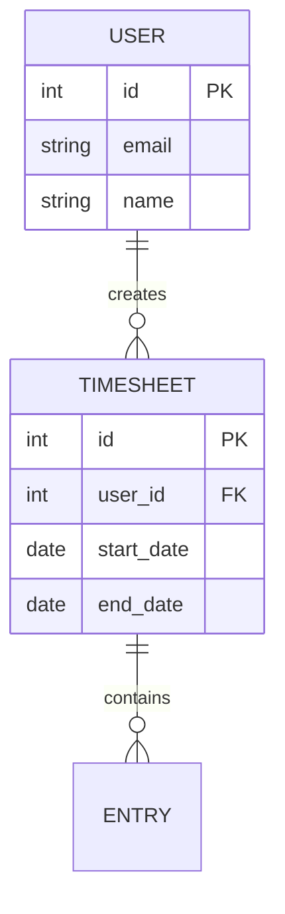
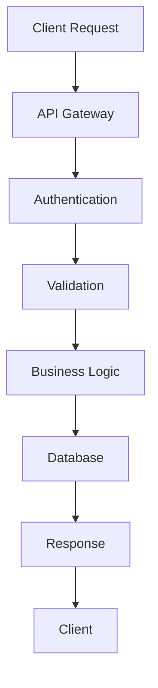

# MERMAID INTEGRATION FRAMEWORK FOR EFTDM
## Enhanced Fast-Track Development Methodology with Mermaid Diagrams

---

## **🎯 Why Mermaid Integration is Game-Changing**

### **1. Visual Clarity**
- **User Journeys**: Clear flow visualization
- **Decision Points**: Obvious branching logic
- **Data Flow**: Understanding of information movement
- **System Architecture**: Component relationships

### **2. Stakeholder Communication**
- **Non-technical stakeholders** can understand flows
- **Developers** get clear implementation guidance
- **QA teams** understand test scenarios
- **Project managers** see progress milestones

### **3. Requirement Validation**
- **Gap identification** through visual analysis
- **Edge case discovery** via flow analysis
- **Validation completeness** through decision trees
- **User experience optimization** through journey mapping

---

## **🔄 Mermaid Integration Workflow**

### **Step 1: Raw Requirements Analysis**
```bash
# Input: Raw requirements document
# Process: Extract key flows and decision points
# Output: Mermaid diagram requirements
```

### **Step 2: Mermaid Diagram Creation**
```bash
# Create diagrams for:
# - User journeys
# - System flows
# - Data flows
# - Decision trees
# - Entity relationships
# - API flows
```

### **Step 3: FSD Generation**
```bash
# Input: Raw requirements + Mermaid diagrams
# Process: Generate comprehensive FSD
# Output: Enhanced FSD with visual flows
```

---

## **📊 Mermaid Diagram Types for FSD**

### **1. User Journey Diagrams**


### **2. System Flow Diagrams**


### **3. Decision Flow Diagrams**


### **4. Data Model Diagrams**


### **5. API Flow Diagrams**


---

## **🛠️ Mermaid Integration Tools**

### **1. Automated Mermaid Generation**
```bash
#!/bin/bash
# generate-mermaid-diagrams.sh

echo "🔄 Generating Mermaid diagrams from requirements..."

# Step 1: Analyze raw requirements
python scripts/analyze-requirements.py

# Step 2: Generate user journey diagrams
python scripts/generate-user-journeys.py

# Step 3: Generate system flow diagrams
python scripts/generate-system-flows.py

# Step 4: Generate decision flow diagrams
python scripts/generate-decision-flows.py

# Step 5: Generate data model diagrams
python scripts/generate-data-models.py

echo "✅ Mermaid diagrams generated successfully!"
```

### **2. Mermaid Validation**
```bash
#!/bin/bash
# validate-mermaid-diagrams.sh

echo "🔍 Validating Mermaid diagrams..."

# Check syntax
for file in diagrams/*.mmd; do
    echo "Validating $file..."
    mermaid-cli -i "$file" -o /dev/null
    if [ $? -eq 0 ]; then
        echo "✅ $file is valid"
    else
        echo "❌ $file has errors"
    fi
done

echo "🎉 Mermaid validation complete!"
```

---

## **📋 Mermaid-Enhanced FSD Template**

### **Template Structure**
```markdown
# FSD WITH MERMAID INTEGRATION

## 1. PROJECT OVERVIEW
## 2. USER JOURNEY & FLOW DIAGRAMS
   ### 2.1 High-Level User Journey
   ### 2.2 Detailed User Flows
   ### 2.3 System Flow Diagrams
   ### 2.4 Decision Flow Diagrams
## 3. FUNCTIONAL REQUIREMENTS
## 4. BUSINESS RULES & VALIDATION
## 5. USER INTERFACE REQUIREMENTS
## 6. TECHNICAL SPECIFICATIONS
## 7. DATA MODEL
## 8. NON-FUNCTIONAL REQUIREMENTS
## 9. ACCEPTANCE CRITERIA
## 10. RISK ASSESSMENT
## 11. IMPLEMENTATION TIMELINE
## 12. APPENDICES
```

### **Mermaid Integration Points**
- **Section 2**: User journey and flow diagrams
- **Section 4**: Business rules and validation flows
- **Section 5**: UI component hierarchy
- **Section 6**: API flow diagrams
- **Section 7**: Entity relationship diagrams
- **Section 8**: Scalability and performance flows
- **Section 9**: Testing scenario flows
- **Section 10**: Risk assessment matrices
- **Section 11**: Gantt charts and timelines

---

## **🚀 Implementation in EFTDM**

### **Phase 1: FSD Analysis with Mermaid**
```bash
# Enhanced Phase 1 with Mermaid integration
1. Analyze raw requirements
2. Generate Mermaid diagrams
3. Validate diagram completeness
4. Create enhanced FSD
5. Validate FSD with stakeholders
```

### **Phase 2: Implementation Planning with Mermaid**
```bash
# Enhanced Phase 2 with Mermaid integration
1. Review FSD diagrams
2. Create technical implementation flows
3. Generate API flow diagrams
4. Create database relationship diagrams
5. Plan development milestones
```

### **Phase 3: Project Setup with Mermaid**
```bash
# Enhanced Phase 3 with Mermaid integration
1. Review system architecture diagrams
2. Set up development environment
3. Create component hierarchy diagrams
4. Set up database schema
5. Configure CI/CD pipelines
```

---

## **📈 Benefits of Mermaid Integration**

### **1. For Product Developers**
- **Clear understanding** of user journeys
- **Visual validation** of requirements
- **Gap identification** through flow analysis
- **Stakeholder alignment** through visual communication

### **2. For Development Teams**
- **Clear implementation guidance** from flow diagrams
- **API design clarity** from sequence diagrams
- **Database design** from ER diagrams
- **Component architecture** from hierarchy diagrams

### **3. For QA Teams**
- **Test scenario identification** from decision flows
- **Edge case discovery** from flow analysis
- **User journey testing** from journey diagrams
- **Integration testing** from system flow diagrams

### **4. For Project Managers**
- **Progress tracking** through milestone diagrams
- **Risk identification** through risk matrices
- **Timeline visualization** through Gantt charts
- **Stakeholder communication** through visual flows

---

## **🔧 Mermaid Integration Scripts**

### **1. Requirements Analysis Script**
```python
#!/usr/bin/env python3
# analyze-requirements.py

import re
import json
from pathlib import Path

def analyze_requirements(file_path):
    """Analyze raw requirements and extract flow information"""
    
    with open(file_path, 'r') as f:
        content = f.read()
    
    # Extract user actions
    user_actions = re.findall(r'user\s+(?:can\s+)?(?:should\s+)?(?:must\s+)?(\w+)', content, re.IGNORECASE)
    
    # Extract decision points
    decision_points = re.findall(r'(?:if|when|whether)\s+([^,\.]+)', content, re.IGNORECASE)
    
    # Extract validation rules
    validation_rules = re.findall(r'(?:validate|check|ensure)\s+([^,\.]+)', content, re.IGNORECASE)
    
    return {
        'user_actions': user_actions,
        'decision_points': decision_points,
        'validation_rules': validation_rules
    }

if __name__ == "__main__":
    requirements = analyze_requirements("raw_requirements.txt")
    print(json.dumps(requirements, indent=2))
```

### **2. Mermaid Diagram Generator**
```python
#!/usr/bin/env python3
# generate-mermaid-diagrams.py

def generate_user_journey_diagram(actions):
    """Generate user journey Mermaid diagram"""
    
    diagram = "graph TD\n"
    
    for i, action in enumerate(actions):
        if i == 0:
            diagram += f"    A[{action.title()}]"
        else:
            diagram += f" --> {chr(65+i)}[{action.title()}]"
    
    return diagram

def generate_decision_flow_diagram(decisions):
    """Generate decision flow Mermaid diagram"""
    
    diagram = "flowchart TD\n"
    
    for i, decision in enumerate(decisions):
        diagram += f"    A[{decision}] --> B{{Decision {i+1}}}\n"
        diagram += f"    B -->|Yes| C[Action {i+1}]\n"
        diagram += f"    B -->|No| D[Alternative {i+1}]\n"
    
    return diagram

if __name__ == "__main__":
    # Generate diagrams based on analyzed requirements
    pass
```

---

## **✅ Mermaid Integration Checklist**

### **Pre-Integration**
- [ ] Raw requirements document available
- [ ] Mermaid CLI installed
- [ ] Diagram generation scripts ready
- [ ] Validation tools configured

### **Integration Process**
- [ ] Analyze raw requirements
- [ ] Generate user journey diagrams
- [ ] Generate system flow diagrams
- [ ] Generate decision flow diagrams
- [ ] Generate data model diagrams
- [ ] Validate all diagrams
- [ ] Integrate diagrams into FSD
- [ ] Review with stakeholders

### **Post-Integration**
- [ ] FSD with Mermaid diagrams complete
- [ ] Stakeholder approval received
- [ ] Development team briefed
- [ ] QA team has test scenarios
- [ ] Project timeline updated

---

## **🎉 Conclusion**

**Mermaid integration transforms FSD creation from text-heavy documents to visual, comprehensive specifications that:**

✅ **Enhance understanding** through visual flows  
✅ **Improve communication** with stakeholders  
✅ **Accelerate development** with clear guidance  
✅ **Reduce errors** through visual validation  
✅ **Increase quality** through comprehensive analysis  

**This approach is a game-changer for the EFTDM methodology!** 🚀

---

**Document Version**: 1.0  
**Created**: [Date]  
**Next Review**: [Date]  
**Status**: Ready for Implementation
